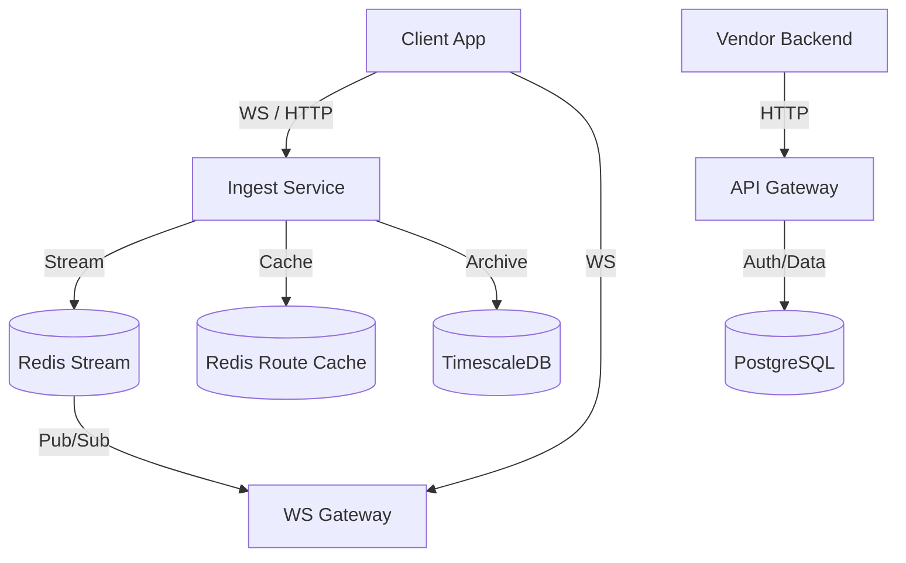

# EvoTrack: Enterprise Live Order Tracking Platform

EvoTrack is a production-grade, multi-region compliant logistics tracking SDK and platform. Designed for high-scale environments (Swiggy, Zomato, Uber), it handles millions of concurrent concurrent orders with sub-second latency location updates.

**Author:** Daksha Dubey  
**License:** MIT

##  Architecture

The system is built as a **Monorepo** containing high-throughput microservices and strictly typed SDKs.



##  Packages

- **`@evotrack/server`**: Node.js SDK for Vendor Backends to create orders and mint tokens.
- **`@evotrack/client`**: Typescript SDK for Delivery Agents (Location Capture) and Customers (Smoothing/Animation).
- **`@evotrack/core`**: Critical Shared Logic, Types, and Zod Schemas.
- **`@evotrack/database`**: Database Abstractions.

##  Getting Started

### 1. Installation

```bash
npm install @evotrack/server @evotrack/client
```

### 2. Backend Usage (Vendor)

```typescript
import { EvoTrack, EvoRole } from '@evotrack/server';

const evo = new EvoTrack({ apiKey: process.env.EVO_KEY });

// Create an Order
const session = await evo.createOrder({
  orderId: 'ORD_1001',
  pickup: { lat: 12.9716, lng: 77.5946 },
  dropoff: { lat: 12.9352, lng: 77.6245 }
});

// Send tokens to apps
// session.tokens.delivery -> To Delivery Partner App
// session.tokens.customer -> To Customer App
```

### 3. Delivery Partner App

```typescript
import { EvoDelivery } from '@evotrack/client';

const tracker = new EvoDelivery({ 
  token: DELIVERY_JWT 
});

// Start background tracking with auto-buffering and retry
tracker.startTracking();
```

### 4. Customer App (React/JS)

```typescript
import { EvoCustomer, EvoMap } from '@evotrack/client';

const customer = new EvoCustomer({ token: CUSTOMER_JWT });
const mapHelper = new EvoMap(googleMapInstance);

customer.subscribe((state) => {
  // Auto-interpolate and move marker
  mapHelper.updateLocation(state.currentLocation.lat, state.currentLocation.lng);
  
  // Update ETA
  updateUI(state.etaSeconds);
});
```

##  Enterprise Security

- **Role-Based JWTs**: Delivery Agents cannot spy on other orders; access is strictly scoped to `orderId`.
- **Anti-Spoofing**: Ingest Service calculates speed and rejects >150km/h jumps or teleportation.
- **Data Isolation**: Multi-tenant architecture ensures Vendor data is logically isolated.

##  Cost Optimization

- **Route Caching**: Polyline requests are cached for 24h based on origin/dest proximity.
- **Throttling**: Location updates are throttled to 3s on client and downstream to 5s for customers to save bandwidth/DB/WS costs.

##  Deployment & Scale

- **Kubernetes**: StatefulSet for Redis, Deployment for stateless Services.
- **Horizontal Scaling**: WS Gateway scales with Redis Adapter.
- **Disaster Recovery**: All state is ephemeral (Redis) or persistent (Postgres). If Redis dies, Agents re-sync latest location.


## 🎮 Running the Demo Project

We have included a full end-to-end demo to visualize EvoTrack in action.

1. **Install Dependencies**
   ```bash
   npm install
   ```
2. **Start Infrastructure (Redis)**
   ```bash
   # Ensure you have a Redis instance running locally or via Docker
   docker run -p 6379:6379 redis
   ```
3. **Start All Services**
   ```bash
   # Starts API Gateway, Ingest, WS Gateway, Demo Backend, and Demo Frontend
   npm run dev
   ```
4. **Open in Browser**
   - Go to `http://localhost:5173`
   - Click **Create Order** to generate a session.
   - Click **Simulate Delivery Agent** to start sending fake location updates.
   - Watch the marker move in real-time!

##  Publishing to NPM

If you want to publish the SDKs to NPM for external use, see [PUBLISHING.md](PUBLISHING.md).

##  Documentation
- [SDK Integration Manual (MERN)](SDK_MANUAL.md) - **Read this for detailed setup & flowcharts.**
- [Publishing Guide](PUBLISHING.md)

##  Why Swiggy/Zomato Adopt This?

1.  **Zero-Downtime Migration**: The SDK wraps existing location logic.
2.  **Cost Control**: Strict guards on Google Maps API usage prevents bill shock.
3.  **Observability**: Built-in OpenTelemetry hooks for every location ping.
